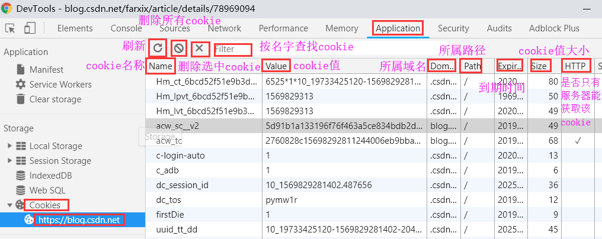
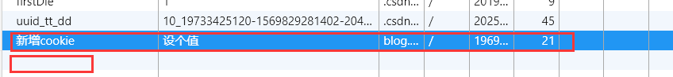
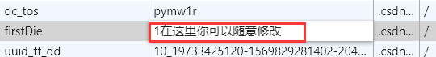
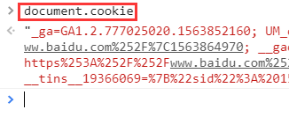
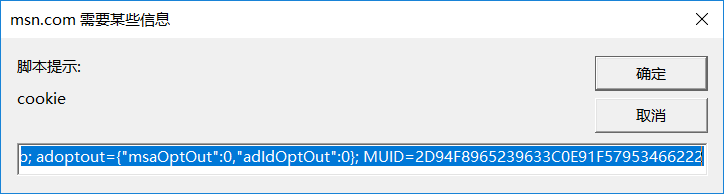

<head>
  <script type="text/javascript">
  (function() {
    var link = document.createElement('link');
    link.type = 'image/x-icon';
    link.rel = 'shortcut icon';
    link.href = '../../h.ico';
    document.getElementsByTagName('head')[0].appendChild(link);
  }());
  </script>
  <link rel="stylesheet" type="text/css" href="../style.css">
</head>


- [闭包](#闭包)
    - [1.变量的作用域](#变量的作用域)
    - [2.如何从外部读取局部变量？](#如何从外部读取局部变量)
    - [3.闭包的概念](#闭包的概念)
    - [4.闭包的用途](#闭包的用途)
    - [5.使用闭包的注意点](#使用闭包的注意点)
    - [6.例子](#例子)
- [JS导入icon](#js导入icon)
- [Cookie](#cookie)
    - [路径](#路径)
    - [查看、修改](#查看、修改)
    - [查看网站cookie快捷方式](#查看网站cookie快捷方式)

## 闭包
#### 变量的作用域
函数内部可以直接读取全局变量
```
var n=999;

function f1(){
  alert(n);
}
f1(); // 999
```
函数外部无法读取函数内的局部变量
```
function f1(){
  var n=999;
}

alert(n); // error
```
但是如果不使用var命令，则声明了一个全局变量
```
function f1(){
  n=999;
}

f1();

alert(n); // 999
```

#### 如何从外部读取局部变量?
在函数的内部，再定义一个函数
```
function f1(){
var n=999;

  function f2(){
    alert(n); // 999
  }
}
```
在上面的代码中，函数f2就被包括在函数f1内部，这时f1内部的所有局部变量，对f2都是可见的。但是反过来就不行，f2内部的局部变量，对f1就是不可见的。这就是Javascript语言特有的"链式作用域"结构（chain scope），子对象会一级一级地向上寻找所有父对象的变量。所以，父对象的所有变量，对子对象都是可见的，反之则不成立。

既然f2可以读取f1中的局部变量，那么只要把f2作为返回值，我们不就可以在f1外部读取它的内部变量了吗！
```
function f1(){
  var n=999;
  
    function f2(){
      alert(n);
  }
  return f2;
}

var result=f1();
result(); // 999
```

#### 闭包的概念
由于在Javascript语言中，只有函数内部的子函数才能读取局部变量，因此可以把闭包简单理解成"定义在一个函数内部的函数"。

所以，在本质上，闭包就是将函数内部和函数外部连接起来的一座桥梁。

#### 闭包的用途
闭包可以用在许多地方。它的最大用处有两个，一个是前面提到的可以读取函数内部的变量，另一个就是让这些变量的值始终保持在内存中。
```
function f1(){
  var n=999;

  nAdd=function(){n+=1}

  function f2(){
    alert(n);
  }
  return f2;
}

  var result=f1();

  result(); // 999
  nAdd();
  result(); // 1000
```
在这段代码中，result实际上就是闭包f2函数。它一共运行了两次，第一次的值是999，第二次的值是1000。这证明了，函数f1中的局部变量n一直保存在内存中，并没有在f1调用后被自动清除。
原因就在于f1是f2的父函数，而f2被赋给了一个全局变量，这导致f2始终在内存中，而f2的存在依赖于f1，因此f1也始终在内存中，不会在调用结束后，被垃圾回收机制（garbage collection）回收。

这段代码中另一个值得注意的地方，就是"nAdd=function(){n+=1}"这一行，首先在nAdd前面没有使用var关键字，因此nAdd是一个全局变量，而不是局部变量。其次，nAdd的值是一个匿名函数（anonymous function），而这个匿名函数本身也是一个闭包，所以nAdd相当于是一个setter，可以在函数外部对函数内部的局部变量进行操作。

#### 使用闭包的注意点
1.由于闭包会使得函数中的变量都被保存在内存中，内存消耗很大，所以不能滥用闭包，否则会造成网页的性能问题，在IE中可能导致内存泄露。解决方法是，在退出函数之前，将不使用的局部变量全部删除。

2.闭包会在父函数外部，改变父函数内部变量的值。所以，如果你把父函数当作对象（object）使用，把闭包当作它的公用方法（Public Method），把内部变量当作它的私有属性（private value），这时一定要小心，不要随便改变父函数内部变量的值。

#### 例子

```
var name = "The Window";

var object = {
  name : "My Object",

  getNameFunc : function(){
    return function(){
      return this.name;
    };
  }
};

alert(object.getNameFunc()());  //The window
```
获取object外的name属性，导致输出的是The window

```
var name = "The Window";
  
  var object = {
    name : "My Object",

    getNameFunc : function(){
      var that = this;
      return function(){
        return that.name;
      };
    }
};

alert(object.getNameFunc()());   //My Object
```
在函数内添加了that指代了函数内的name属性，导致显示的是object内的My Object


## JS导入icon

```
<script type="text/javascript">
	(function() {
		var link = document.createElement('link');
		link.type = 'image/x-icon';
		link.rel = 'shortcut icon';
		link.href = 'h.ico';
		document.getElementsByTagName('head')[0].appendChild(link);
	}());
</script>
```


<div id="toTop">
  <a href="#" class="ryi-angle-up"></a>
</div>


## Cookie

#### 路径

1. **IE浏览器Cookie数据位于**：

   ```
   %APPDATA%\Microsoft\Windows\Cookies\ 目录中的xxx.txt文件 （里面可能有很多个.txt Cookie文件）
   如: C:\Users\Administrator\AppData\Roaming\Microsoft\Windows\Cookies\administrator@live.letv.txt
   ```

2. **Firefox的Cookie数据位于**：

   ```
   %APPDATA%\Mozilla\Firefox\Profiles\ 目录中的xxx.default目录，名为cookies.sqlite的文件。
   如：C:\Users\Administrator\AppData\Roaming\Mozilla\Firefox\Profiles\ji4grfex.default\cookies.sqlite
   在Firefox中查看cookie, 可以选择”工具 > 选项 >” “隐私 > 移除单个Cookie”。
   ```

3. **Chrome的Cookie数据位于**：

   ```
   %LOCALAPPDATA%\Google\Chrome\User Data\Default\ 目录中，名为Cookies的文件。
   如：C:\Users\Administrator\AppData\Local\Google\Chrome\User Data\Default\Cookies
   ```

P.S. sqlite文件可以使用软件SQLiteManager打开

#### 查看、修改

使用开发者工具查看cookie



双击空白处即刻新增cookie，自定义名称、对应的值、所属网址域名、域名下具体地址、到期时间



点击想要修改的cookie，在需要修改的cookie的某一具体属性处，双击即可修改




#### 查看网站cookie快捷方式

1. 地址栏运行js代码

   在浏览器地址栏输入：`javascript:alert(document.cookie)`，按回车会弹出当前网页登录的cookie信息

2. 开发者工具控制台

   调出开发者工具 --- console --- 输入: document.cookie --- 回车即刻

   

3. 可复制的cookie信息

   在浏览器地址栏输入：`javascript:prompt("cookie",document.cookie)`，按回车会弹出当前网页登录的cookie信息

   

