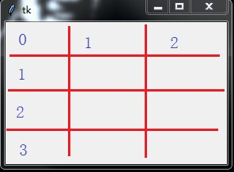

<head>
  <link rel="icon" type="image/x-icon" href="h.ico" />
  <link rel="stylesheet" type="text/css" href="style.css">
</head>

- [图形化界面设计的基本理解](#图形化界面设计的基本理解)
- [窗体控件布局](#窗体控件布局)
- [tkinter常用控件](#tkinter常用控件)
  - [常用控件](#常用控件)
  - [控件的共同属性](#控件的共同属性)
- [控件布局](#控件布局)
  - [pack方法](#pack方法)
    - [pack方法常用属性](#pack方法常用属性)
    - [pack类函数](#pack类函数)
  - [grid方法](#grid方法)
    - [grid方法常用属性](#grid方法常用属性)
    - [grid类函数](#grid类函数)
  - [place方法](#place方法)
    - [place方法常用属性](#place方法常用属性)
    - [place类函数](#place类函数)
- [常见控件属性](#常见控件属性)
  - [标签(Label)和消息(Message)](#标签label和消息message)
    - [常用参数](#常用参数)
  - [文本框(Text)](#文本框text)
    - [常用参数](#常用参数-1)
    - [常用方法](#常用方法)
  - [输入框(Entry)](#输入框entry)
  - [按钮(Button)](#按钮button)
    - [常用参数](#常用参数-2)
  - [单选按钮(Radiobutton)](#单选按钮radiobutton)
    - [常用参数(与复选框一样)](#常用参数与复选框一样)
  - [复选框(Checkbutton)](#复选框checkbutton)
  - [列表框(Listbox)](#列表框listbox)
  - [组合框(Combobox)](#组合框combobox)
  - [滑块(Scale)](#滑块scale)
    - [常用参数](#常用参数-3)
  - [菜单(Menu)](#菜单menu)
    - [常用参数](#常用参数-4)
    - [常用方法](#常用方法-1)
  - [子窗体](#子窗体)
- [模式对话框(Modal)](#模式对话框modal)
  - [交互对话框](#交互对话框)
    - [消息对话框(messagebox)](#消息对话框messagebox)
      - [messagebox._show函数的控制参数](#messagebox_show函数的控制参数)
    - [输入对话框](#输入对话框)
      - [常用参数](#常用参数-5)
  - [文件选择对话框](#文件选择对话框)
    - [常用参数](#常用参数-6)
  - [颜色选择对话框](#颜色选择对话框)
    - [常用参数](#常用参数-7)
- [事件响应](#事件响应)
  - [事件参数](#事件参数)
  - [窗口事件](#窗口事件)
  - [鼠标键盘事件](#鼠标键盘事件)
  - [响应事件](#响应事件)

&nbsp;
&nbsp;
&nbsp;

## 图形化界面设计的基本理解

当前流行的计算机桌面应用程序大多数为图形化用户界面（Graphic User Interface,GUI）,即通过鼠标对菜单、按钮等图形化元素触发指令,并从标签、对话框等图型化显示容器中获取人机对话信息。
 Python自带了tkinter 模块，实质上是一种流行的面向对象的GUI工具包 TK 的Python编程接口，提供了快速便利地创建GUI应用程序的方法。其图像化编程的基本步骤通常包括：

- 导入 tkinter 模块
- 创建 GUI 根窗体
- 添加人机交互控件并编写相应的函数。
- 在主事件循环中等待用户触发事件响应。

## 窗体控件布局

- 根窗体是图像化应用程序的根控制器，是tkinter的底层控件的实例。当导入tkinter模块后，调用 Tk()方法可初始化一个根窗体实例 root ,用 title() 方法可设置其标题文字，用geometry()方法可以设置窗体的大小（以像素为单位）。将其置于主循环中，除非用户关闭，否则程序始终处于运行状态。执行该程序，一个窗体就呈现出来了。在这个主循环的根窗体中，可持续呈现中的其他可视化控件实例，监测事件的发生并执行相应的处理程序。下面是根窗体呈现示例：

  

  ```python
  from tkinter import *
  root= Tk()
  root.title('我的第一个Python窗体')
  root.geometry('240x240') # 这里的乘号不是 * ，而是小写英文字母 x
  root.mainloop()
  ```


## tkinter常用控件

### 常用控件

| 控件        | 名称         | 作用                                                         |
| ----------- | ------------ | ------------------------------------------------------------ |
| Button      | 按钮         | 单击触发事件                                                 |
| Canvas      | 画布         | 绘制图形或绘制特殊控件                                       |
| Checkbutton | 复选框       | 多项选择                                                     |
| Entry       | 输入框       | 接收单行文本输入                                             |
| Frame       | 框架         | 用于控件分组                                                 |
| Label       | 标签         | 单行文本显示                                                 |
| Lisbox      | 列表框       | 显示文本列表                                                 |
| Menu        | 菜单         | 创建菜单命令                                                 |
| Menubutton  | 菜单         | 它的功能完全可以使用Menu替代                                 |
| Message     | 消息         | 多行文本标签，与Label 用法类似                               |
| Radiobutton | 单选按钮     | 从互斥的多个选项中做单项选择                                 |
| Scale       | 滑块         | 默认垂直方向，鼠标拖动改变数值形成可视化交互                 |
| Scrollbar   | 滑动条       | 默认垂直方向，课鼠标拖动改变数值，可与 Text、Lisbox、Canvas等控件配合移动可视化空间 |
| Text        | 文本框       | 接收或输出显示多行文本                                       |
| Toplevel    | 新建窗体容器 | 在顶层创建新窗体                                             |

### 控件的共同属性

在窗体上呈现的可视化控件，通常包括尺寸、颜色、字体、相对位置、浮雕样式、图标样式和悬停光标形状等共同属性。不同的控件由于形状和功能不同，又有其特征属性。在初始化根窗体和根窗体主循环之间，可实例化窗体控件，并设置其属性。父容器可为根窗体或其他容器控件实例。常见的控件共同属性如下表：

| 属性    | 说明                               | 取值                                |
| ------- | ---------------------------------- | ----------------------------------- |
| anchor  | 文本起始位置                       | CENTER(默认)，E,S,W,N,NE,SE,SW,NW   |
| bg      | 背景色                             | 无                                  |
| bd      | 加粗（默认 2 像素）                | 无                                  |
| bitmap  | 黑白二值图标                       | 网上查找                            |
| cursor  | 鼠标悬停光标                       | 网上查找                            |
| font    | 字体                               | 无                                  |
| fg      | 前景色                             | 无                                  |
| height  | 高（文本控件的单位为行，不是像素） | 无                                  |
| image   | 显示图像                           | 无                                  |
| justify | 多行文本的对其方式                 | CENTER(默认)，LEFT,RIGHT,TOP,BOTTOM |
| padx    | 水平扩展像素                       | 无                                  |
| pady    | 垂直扩展像素                       | 无                                  |
| relief  | 3D浮雕样式                         | FLAT,RAISED,SUNKEN,GROOVE,RIDGE     |
| state   | 控件实例状态是否可用               | NORMAL(默认)，DISABLED              |
| width   | 宽(文本控件的单位为行，不是像素)   | 无                                  |


标签及常见属性示例：

```bash
from  tkinter import *
root = Tk()
lb = Label(root,text='我是第一个标签',\
        bg='#d3fbfb',\
        fg='red',\
        font=('华文新魏',32),\
        width=20,\
        height=2,\
        relief=SUNKEN)
lb.pack()
root.mainloop()
```


其中，标签实例lb 在父容器root中实例化，具有代码中所示的text（文本）、bg（背景色）、fg(前景色)、font（字体）、width（宽，默认以字符为单位）、height（高，默认以字符为单位）和 relief（浮雕样式）等一系列属性。

在实例化控件时，实例的属性可以“属性=属性值”的形式枚举列出，不区分先后次序。例如：

“ text='我是第一个标签' ”

显示标签的文本内容，“bg='#d3fbfb'”设置背景色为十六进制数RGB色 #d3fbfb等等。属性值通常用文本形式表示。

当然如果这个控件实例只需要一次性呈现，也可以不必命名，直接实例化并布局呈现出来，例如：

```bash
Label(root,text='我是第一个标签',font='华文新魏').pack()
```

属性 relief 为控件呈现出来的3D浮雕样式，有 FLAT(平的)、RAISED(凸起的)、SUNKEN(凹陷的)、GROOVE(沟槽状边缘)和 RIDGE(脊状边缘) 5种。


## 控件布局

 控件的布局通常有`pack()`、`grid()` 和 `place()` 三种方法。

### pack方法

#### pack方法常用属性

| 属性名       | 属性简析                                                     | 取值                                                 | 取值说明                                                     |
| ------------ | ------------------------------------------------------------ | ---------------------------------------------------- | ------------------------------------------------------------ |
| fill         | 设置组件是否向水平或垂直方向填充                             | X、Y、BOTH 和NONE                                    | fill = X（水平方向填充）fill = Y（垂直方向填充）fill = BOTH（水平和垂直）NONE 不填充 |
| expand       | 设置组件是否展开，当值为YES时，side选项无效。组件显示在父容器中心位置；若fill选项为BOTH,则填充父组件的剩余空间。默认为不展开 | YES 、NO（1、0）                                     | expand=YES expand=NO                                         |
| side         | 设置组件的对齐方式                                           | LEFT、TOP、RIGHT、BOTTOM                             | 值为左、上、右、下                                           |
| ipadx、ipady | 设置x方向（或者y方向）内部间隙（子组件之间的间隔）           | 可设置数值，默认是0                                  | 非负整数，单位为像素                                         |
| padx、pady   | 设置x方向（或者y方向）外部间隙（与之并列的组件之间的间隔）   | 可设置数值，默认是0                                  | 非负整数，单位为像素                                         |
| anchor       | 锚选项，当可用空间大于所需求的尺寸时，决定组件被放置于容器的何处 | N、E、S、W、NW、NE、SW、SE、CENTER（默认值为CENTER） | 表示八个方向以及中心                                         |

使用pack()方法可设置 fill、side 等属性参数。

参数fill 可取值：fill=X,fill=Y或fill=BOTH，分别表示允许控件向水平方向、垂直方向或二维伸展填充未被占用控件

参数 side 可取值：side=TOP(默认)，side=LEFT,side=RIGHT,side=BOTTOM,分别表示本控件实例的布局相对于下一个控件实例的方位。

```bash
from tkinter import  *
root = Tk()

lbred = Label(root,text="Red",fg="Red",relief=GROOVE)
lbred.pack()
lbgreen = Label(root,text="绿色",fg="green",relief=GROOVE)
lbgreen.pack(side=RIGHT)
lbblue = Label(root,text="蓝",fg="blue",relief=GROOVE)
lbblue.pack(fill=X)
root.mainloop()
```


#### pack类函数

（使用组件实例对象调用）

| 函数名                       | 描述                                                         |
| ---------------------------- | ------------------------------------------------------------ |
| pack_slaves()                | 以列表方式返回本组件的所有子组件对象。                       |
| pack_configure(option=value) | 给pack布局管理器设置属性，使用属性（option）= 取值（value）方式设置 |
| propagate(boolean)           | 设置为True表示父组件的几何大小由子组件决定（默认值），反之则无关。 |
| pack_info()                  | 返回pack提供的选项所对应得值。                               |
| pack_forget()                | Unpack组件，将组件隐藏并且忽略原有设置，对象依旧存在，可以用pack(option, …)，将其显示。 |
| location(x, y)               | x, y为以像素为单位的点，函数返回此点是否在单元格中，在哪个单元格中。返回单元格行列坐标，(-1, -1)表示不在其中 |
| size()                       | 返回组件所包含的单元格，揭示组件大小。                       |

```bash
from tkinter import  *
root = Tk()

lbred = Label(root,text="Red",fg="Red",relief=GROOVE)
lbred.pack()
lbgreen = Label(root,text="绿色",fg="green",relief=GROOVE)
lbgreen.pack()
lbblue = Label(root,text="蓝",fg="blue",relief=GROOVE)
lbblue.pack()
root.mainloop()
```


### grid方法

是基于网格的布局。先虚拟一个二维表格，再在该表格中布局控件实例。由于在虚拟表格的单元中所布局的控件实例大小不一，单元格也没有固定或均一的大小，因此其仅用于布局的定位。pack()方法与grid()方法不能混合使用。

####  grid方法常用属性

| 属性名                   | 属性简析                                              | 取值                               | 取值说明                                                     |
| ------------------------ | ----------------------------------------------------- | ---------------------------------- | ------------------------------------------------------------ |
| row、column              | row为行号，column为列号，设置将组件放置于第几行第几列 | 取值为行、列的序号，不是行数与列数 | row 和 column 的序号从0开始，但是，column的默认值是0，row的默认值是下一个编号较大的未占用行号 |
| sticky                   | 设置组件在网格中的对齐方式（前提是有额外的空间）      | N、E、S、W、NW、NE、SW、SE         | 类似于pack布局中的锚选项                                     |
| rowspan                  | 组件所跨越的行数                                      | 默认值为1                          | 取值为跨越占用的行数，而不是序号                             |
| columnspan               | 组件所跨越的列数                                      | 默认值为1                          | 取值为跨越占用的列数，而不是序号                             |
| ipadx、ipady、padx、pady | 组件的内部、外部间隔距离，与pack的该属性用法相同      | 同pack                             | 同pack                                                       |

#### grid类函数

（使用组件实例对象调用）

| 函数名                       | 描述                                                         |
| ---------------------------- | ------------------------------------------------------------ |
| grid_slaves()                | 以列表方式返回本组件的所有子组件对象。                       |
| grid_configure(option=value) | 给pack布局管理器设置属性，使用属性（option）= 取值（value）方式设置 |
| grid_propagate(boolean)      | 设置为True表示父组件的几何大小由子组件决定（默认值），反之则无关。 |
| grid_info()                  | 返回pack提供的选项所对应得值。                               |
| grid_forget()                | x, y为以像素为单位的点，函数返回此点是否在单元格中，在哪个单元格中。返回单元格行列坐标，(-1, -1)表示不在其中 |
| size()                       | 返回组件所包含的单元格，揭示组件大小。                       |




下面的例子：用grid()方法排列标签，设想有一个3x4的表格，起始行、列序号均为0.将标签lbred 至于第2列第0行；将标签lbgreen置于第0列第1行；将标签lbblue置于第1列起跨2列第2行，占20像素宽。

```bash
from tkinter import  *
root = Tk()

lbred = Label(root,text="Red",fg="Red",relief=GROOVE)
lbred.grid(column=2,row=0)
lbgreen = Label(root,text="绿色",fg="green",relief=GROOVE)
lbgreen.grid(column=0,row=1)
lbblue = Label(root,text="蓝",fg="blue",relief=GROOVE)
lbblue.grid(column=1,columnspan=2,ipadx=20,row=2)
root.mainloop()
```

### place方法

根据控件实例在父容器中的绝对或相对位置参数进行布局。

#### place方法常用属性

| 属性名              | 属性简析                     | 取值          | 取值说明                                                     |
| ------------------- | ---------------------------- | ------------- | ------------------------------------------------------------ |
| anchor              | 锚选项，同pack布局           | 默认值为 NW   | 同pack布局                                                   |
| x、y                | 组件左上角的x、y坐标         | 整数，默认值0 | 绝对位置坐标，单位像素                                       |
| relx、rely          | 组件相对于父容器的x、y坐标   | 0~1之间浮点数 | 相对位置，0.0表示左边缘（或上边缘），1.0表示右边缘（或下边缘） |
| width、height       | 组件的宽度、高度             | 非负整数      | 单位像素                                                     |
| relwidth、relheight | 组件相对于父容器的宽度、高度 | 0~1之间浮点数 | 与relx（rely）取值相似                                       |

bordermode 如果设置为INSIDE，组件内部的大小和位置是相对的，不包括边框；如果是OUTSIDE，组件的外部大小是相对的，包括边框 INSIDE、OUTSIDE(默认值INSIDE) 可以使用常量INSIDE、OUTSIDE，也可以使用字符串形式"inside"、"outside"

#### place类函数

（使用组件实例对象调用）

| 函数名                        | 描述                                                         |
| ----------------------------- | ------------------------------------------------------------ |
| place_slaves()                | 以列表方式返回本组件的所有子组件对象。                       |
| place_configure(option=value) | 给pack布局管理器设置属性，使用属性（option）= 取值（value）方式设置 |
| propagate(boolean)            | 设置为True表示父组件的几何大小由子组件决定（默认值），反之则无关。 |
| place_info()                  | 返回pack提供的选项所对应得值。                               |
| grid_forget()                 | Unpack组件，将组件隐藏并且忽略原有设置，对象依旧存在，可以用pack(option, …)，将其显示。 |
| location(x, y)                | x, y为以像素为单位的点，函数返回此点是否在单元格中，在哪个单元格中。返回单元格行列坐标，(-1, -1)表示不在其中 |
| size()                        | 返回组件所包含的单元格，揭示组件大小。                       |


```python
from tkinter import *
root = Tk()
root.geometry('320x240')

msg1 = Message(root,text='''我的水平起始位置相对窗体 0.2，垂直起始位置为绝对位置 80 像素，我的高度是窗体高度的0.4，宽度是200像素''',relief=GROOVE)
msg1.place(relx=0.2,y=80,relheight=0.4,width=200)
root.mainloop()
```


## 常见控件属性

文本的输入与输出控件通常包括：标签（Label）、消息（Message）、输入框（Entry）、文本框（Text）。他们除了前述共同属性外，都具有一些特征属性和功能。


### 标签(Label)和消息(Message)

#### 常用参数

| 属性名          | 属性简析                                |
| --------------- | --------------------------------------- |
| Anchor          | 标签中文本的位置                        |
| background(bg)  | 背景色                                  |
| foreground(fg)  | 前景色                                  |
| borderwidth(bd) | 边框宽度                                |
| width           | 标签宽度                                |
| height          | 标签高度                                |
| bitmap          | 标签中的位图                            |
| font            | 字体                                    |
| image           | 标签中的图片                            |
| justify         | 多行文本的对齐方式                      |
| text            | 标签中的文本，可以使用'\n'表示换行      |
| textvariable    | 显示文本自动更新，与StringVar等配合着用 |

除了单行与多行的不同外，属性和用法基本一致，用于呈现文本信息。值得注意的是：属性text通常用于实例在第一次呈现时的固定文本，而如果需要在程序执行后发生变化，则可以使用下列方法之一实现：**1、用控件实例的configure()方法来改变属性text的值，可使显示的文本发生变化；2、先定义一个tkinter的内部类型变量var=StringVar() 的值也可以使显示文本发生变化。**

 **看下面的一个例子**：制作一个**电子时钟**，用root的after()方法每隔1秒time模块以获取系统当前时间，并在标签中显示出来。

- 例子一：利用configure()方法或config()来实现文本变化。

```python
import tkinter
import time

def gettime():
      timestr = time.strftime("%H:%M:%S") # 获取当前的时间并转化为字符串
      lb.configure(text=timestr)   # 重新设置标签文本
      root.after(1000,gettime) # 每隔1s调用函数 gettime 自身获取时间

root = tkinter.Tk()
root.title('时钟')

lb = tkinter.Label(root,text='',fg='blue',font=("黑体",80))
lb.pack()
gettime()
root.mainloop()
```

- 例子二：利用textvariable变量属性来实现文本变化。

```python
import tkinter
import time

def gettime():
      var.set(time.strftime("%H:%M:%S"))   # 获取当前时间
      root.after(1000,gettime)   # 每隔1s调用函数 gettime 自身获取时间

root = tkinter.Tk()
root.title('时钟')
var=tkinter.StringVar()

lb = tkinter.Label(root,textvariable=var,fg='blue',font=("黑体",80))
lb.pack()
gettime()
root.mainloop()
```


### 文本框(Text)

#### 常用参数

| 属性名           | 属性简析                                    |
| ---------------- | ------------------------------------------- |
| background(bg)   | 文本框背景色                                |
| foreground(fg)   | 前景色                                      |
| selectbackground | 选定文本背景色                              |
| selectforeground | 选定文本前景色                              |
| borderwidth(bd)  | 文本框边框宽度                              |
| font             | 字体                                        |
| show             | 文本框显示的字符，若为*，表示文本框为密码框 |
| state            | 状态                                        |
| width            | 文本框宽度                                  |
| textvariable     | 可变文本，与StringVar等配合着用             |

#### 常用方法

| 方法                          | 功能                               |
| ----------------------------- | ---------------------------------- |
| delete(起始位置，[,终止位置]) | 删除指定区域文本                   |
| get(起始位置，[,终止位置])    | 获取指定区域文本                   |
| insert(位置，[,字符串]...)    | 将文本插入到指定位置               |
| see(位置)                     | 在指定位置是否可见文本，返回布尔值 |
| index(标记)                   | 返回标记所在的行和列               |
| mark_names()                  | 返回所有标记名称                   |
| mark_set(标记，位置)          | 在指定位置设置标记                 |
| mark_unset(标记)              | 去除标记                           |

上表位置的取值可为整数，浮点数或END（末尾），例如0.0表示第0列第0行


- 例子：每隔1秒获取一次当前日期的时间，并写入文本框中，如下：本例中调用 datetime.now()获取当前日期时间，用insert()方法每次从文本框的尾部（END）开始追加文本。

```python
from tkinter import *
import time
import datetime

def gettime():
       s=str(datetime.datetime.now())+'\n'
       txt.insert(END,s)
       root.after(1000,gettime)  # 每隔1s调用函数 gettime 自身获取时间

root=Tk()
root.geometry('320x240')
txt=Text(root)
txt.pack()
gettime()
root.mainloop()
```


### 输入框(Entry)

通常作为功能比较单一的接收单行文本输入的控件，虽然也有许多对其中文本进行操作的方法，但通常用的只有取值方法get()和用于删除文本的delete(起始位置，终止位置)，例如：清空输入框为delete(0，END)。


### 按钮(Button)

#### 常用参数

| 属性名           | 属性简析                            |
| ---------------- | ----------------------------------- |
| anchor           | 指定按钮上文本的位置                |
| background(bg)   | 指定按钮的背景色                    |
| foreground(fg)   | 指定按钮的前景色                    |
| bitmap           | 指定按钮上显示的位图                |
| borderwidth(bd)  | 指定按钮边框的宽度                  |
| command          | 指定按钮消息的回调函数              |
| cursor           | 指定鼠标移动到按钮上的指针样式      |
| font             | 指定按钮上文本的字体                |
| height           | 指定按钮的高度                      |
| width            | 指定按钮的宽度                      |
| image            | 指定按钮上显示的图片                |
| state            | 指定按钮的状态（disabled）          |
| text             | 指定按钮上显示的文本                |
| padx             | 设置文本与按钮边框x的距离，还有pady |
| activeforeground | 按下时前景色                        |
| textvariable     | 可变文本，与StringVar等配合着用     |

主要是为响应鼠标单击事件触发运行程序所设的，故其除控件共有属性外，属性command是最为重要的属性。通常，将按钮要触发执行的程序以函数形式预先定义，然后可以用一下两种方法调用函数。Button按钮的状态有：`'normal','active','disabled'`

- 直接调用函数。**参数表达式为“command=函数名”，注意函数名后面不要加括号，也不能传递参数**。如下面的command=run1：

- 利用匿名函数调用函数和传递参数。参数的表达式为“command=lambda”:函数名（参数列表）。例如下面的："command=lambda:run2(inp1.get(),inp2.get())"。

- 例子：1.从两个输入框去的输入文本后转为浮点数值进行加法运算，要求每次单击按钮产生的算是结果以文本的形式追加到文本框中，将原输入框清空。2.按钮方法一不传参数调用函数run1()实现，按钮“方法二”用lambda调用函数run2(x,y)同时传递参数实现。

```ruby
from tkinter import *

def run1():
     a = float(inp1.get())
     b = float(inp2.get())
     s = '%0.2f+%0.2f=%0.2f\n' % (a, b, a + b)
     txt.insert(END, s)   # 追加显示运算结果
     inp1.delete(0, END)  # 清空输入
     inp2.delete(0, END)  # 清空输入

def run2(x, y):
     a = float(x)
     b = float(y)
     s = '%0.2f+%0.2f=%0.2f\n' % (a, b, a + b)
     txt.insert(END, s)   # 追加显示运算结果
     inp1.delete(0, END)  # 清空输入
     inp2.delete(0, END)  # 清空输入

root = Tk()
root.geometry('460x240')
root.title('简单加法器')

lb1 = Label(root, text='请输入两个数，按下面两个按钮之一进行加法计算')
lb1.place(relx=0.1, rely=0.1, relwidth=0.8, relheight=0.1)
inp1 = Entry(root)
inp1.place(relx=0.1, rely=0.2, relwidth=0.3, relheight=0.1)
inp2 = Entry(root)
inp2.place(relx=0.6, rely=0.2, relwidth=0.3, relheight=0.1)

# 方法-直接调用 run1()
btn1 = Button(root, text='方法一', command=run1)
btn1.place(relx=0.1, rely=0.4, relwidth=0.3, relheight=0.1)

# 方法二利用 lambda 传参数调用run2()
btn2 = Button(root, text='方法二', command=lambda: run2(inp1.get(), inp2.get()))
btn2.place(relx=0.6, rely=0.4, relwidth=0.3, relheight=0.1)

# 在窗体垂直自上而下位置60%处起，布局相对窗体高度40%高的文本框
txt = Text(root)
txt.place(rely=0.6, relheight=0.4)

root.mainloop()
```


### 单选按钮(Radiobutton)

#### 常用参数(与复选框一样)

| 属性名          | 属性简析                                      |
| --------------- | --------------------------------------------- |
| anchor          | 文本的位置                                    |
| background(bg)  | 背景色                                        |
| foreground(fg)  | 前景色                                        |
| borderwidth(bd) | 边框的宽度                                    |
| height          | 组件的高度                                    |
| width           | 组件的宽度                                    |
| bitmap          | 组件上显示的位图                              |
| image           | 组件上显示的图片                              |
| font            | 字体                                          |
| justify         | 组件中多行文本的对齐方式                      |
| text            | 指定组件上显示的文本                          |
| value           | 指定组件被选中中关联变量的值                  |
| variable        | 指定组件所关联的变量                          |
| indicatoron     | 特殊控制参数，当为0时，组件会被绘制成按钮形式 |
| textvariable    | 可变文本，与StringVar等配合着用               |

是为了响应故乡排斥的若干单选项的单击事件以触发运行自定义函数所设的，该控件排除具有共有属性外，还具有显示文本（text）、返回变量（variable）、返回值（value）、响应函数名（command）等重要属性。响应函数名“command=函数名”的用法与Button相同，函数名最后也要加括号。返回变量variable=var通常应预先声明变量的类型var=IntVar()或var=StringVar(),在所调用的函数中方可用var.get()方法获取被选中实例的value值。

- 例子：

```csharp
from tkinter import *
def Mysel():
      dic = {0:'甲',1:'乙',2:'丙'}
      s = "您选了" + dic.get(var.get()) + "项"
      lb.config(text = s)

root = Tk()
root.title('单选按钮')
lb = Label(root)
lb.pack()

var = IntVar()
rd1 = Radiobutton(root,text="甲",variable=var,value=0,command=Mysel)
rd1.pack()

rd2 = Radiobutton(root,text="乙",variable=var,value=1,command=Mysel)
rd2.pack()

rd3 = Radiobutton(root,text="丙",variable=var,value=2,command=Mysel)
rd3.pack()

root.mainloop()
```


### 复选框(Checkbutton)

是为了返回多个选项值的交互控件，通常不直接触发函数的执行。该控件除具有共有属性外，还具有显示文本（text）、返回变量（variable）、选中返回值（onvalue）和未选中默认返回值（offvalue）等重要属性。返回变量variable=var 通常可以预先逐项分别声明变量的类型var=IntVar() (默认)或 var=StringVar(), 在所调用的函数中方可分别调用 var.get()方法 取得被选中实例的 onvalue或offvalue值。复选框实例通常还可分别利用 select()、deselect()和 toggle() 方法对其进行选中、清除选中和反选操作。

- 例子： 利用复选框实现，单击OK，可以将选中的结果显示在标签上。如下：
  - 方法：利用函数中的 if-else 分支实现多项显示

```csharp
from tkinter import *
import tkinter

def run():
     if(CheckVar1.get()==0 and CheckVar2.get()==0 and CheckVar3.get()==0 and CheckVar4.get()==0):
         s = '您还没选择任何爱好项目'
     else:
         s1 = "足球" if CheckVar1.get()==1 else ""
         s2 = "篮球" if CheckVar2.get() == 1 else ""
         s3 = "游泳" if CheckVar3.get() == 1 else ""
         s4 = "田径" if CheckVar4.get() == 1 else ""
         s = "您选择了%s %s %s %s" % (s1,s2,s3,s4)
     lb2.config(text=s)

root = Tk()
root.title('复选框')
lb1=Label(root,text='请选择您的爱好项目')
lb1.pack()

CheckVar1 = IntVar()
CheckVar2 = IntVar()
CheckVar3 = IntVar()
CheckVar4 = IntVar()

ch1 = Checkbutton(root,text='足球',variable = CheckVar1,onvalue=1,offvalue=0)
ch2 = Checkbutton(root,text='篮球',variable = CheckVar2,onvalue=1,offvalue=0)
ch3 = Checkbutton(root,text='游泳',variable = CheckVar3,onvalue=1,offvalue=0)
ch4 = Checkbutton(root,text='田径',variable = CheckVar4,onvalue=1,offvalue=0)

ch1.pack()
ch2.pack()
ch3.pack()
ch4.pack()

btn = Button(root,text="OK",command=run)
btn.pack()

lb2 = Label(root,text='')
lb2.pack()
root.mainloop()
```


### 列表框(Listbox) 

列表框：可供用户单选或多选所列条目以形成人机交互。列表框控件的主要方法见下面的表：

| 方法                       | 功能描述                                                     |
| -------------------------- | ------------------------------------------------------------ |
| curselection()             | 返回光标选中项目编号的元组，注意并不是单个的整数             |
| delete(起始位置，终止位置) | 删除项目，终止位置可省略，全部清空为delete(0,END)            |
| get(起始位置，终止位)      | 返回范围所含项目文本的元组，终止位置可忽略                   |
| insert(位置，项目元素)     | 插入项目元素（若有多项，可用列表或元组类型赋值），若位置为END，则将项目元素添加在最后 |
| size()                     | 返回列表框行数                                               |

执行自定义函数时，通常使用“实例名.surselection()” 或 “selected” 来获取选中项的位置索引。由于列表框实质上就是将Python 的列表类型数据可视化呈现，在程序实现时，也可直接对相关列表数据进行操作，然后再通过列表框展示出来，而不必拘泥于可视化控件的方法。

- 例子：实现列表框的初始化、添加、插入、修改、删除和清空操作，如下：

```python
from tkinter import *
def ini():
      Lstbox1.delete(0,END)
      list_items = ["数学","物理","化学","语文","外语"]
      for item in list_items:
           Lstbox1.insert(END,item)

def clear():
      Lstbox1.delete(0,END)

def ins():
      if entry.get() != '':
          if Lstbox1.curselection() == ():
              Lstbox1.insert(Lstbox1.size(),entry.get())
          else:
              Lstbox1.insert(Lstbox1.curselection(),entry.get())

def updt():
      if entry.get() != '' and Lstbox1.curselection() != ():
           selected=Lstbox1.curselection()[0]
           Lstbox1.delete(selected)
           Lstbox1.insert(selected,entry.get())

def delt():
      if Lstbox1.curselection() != ():
           Lstbox1.delete(Lstbox1.curselection())

root = Tk()
root.title('列表框实验')
root.geometry('320x240')

frame1 = Frame(root,relief=RAISED)
frame1.place(relx=0.0)

frame2 = Frame(root,relief=GROOVE)
frame2.place(relx=0.5)

Lstbox1 = Listbox(frame1)
Lstbox1.pack()

entry = Entry(frame2)
entry.pack()

btn1 = Button(frame2,text='初始化',command=ini)
btn1.pack(fill=X)

btn2 = Button(frame2,text='添加',command=ins)
btn2.pack(fill=X)

btn3 = Button(frame2,text='插入',command=ins) # 添加和插入功能实质上是一样的
btn3.pack(fill=X)

btn4 = Button(frame2,text='修改',command=updt)
btn4.pack(fill=X)

btn5 = Button(frame2,text='删除',command=delt)
btn5.pack(fill=X)

btn6 = Button(frame2,text='清空',command=clear)
btn6.pack(fill=X)

root.mainloop()
```


### 组合框(Combobox)

实质上是带文本框的上拉列表框，其功能也将是Python 的列表类型数据可视化呈现，并提供用户单选或多选所列条目以形成人机交互。在图形化界面设计时，由于其具有灵活的界面，因此往往比列表框更受喜爱。但该控件并不包含在 tkinter 模块中，而是与 TreeView、Progressbar、Separator等控件一同包含在tkinter 的子模块ttk中。如果使用该控件，应先与from tkinter import ttk 语句引用ttk子模块，然后创建组合框实例： `实例名=Combobox(根对象,[属性列表])`
 指定变量var=StringVar(),并设置实例属性 textvariable = var,values=[列表...]。组合框控件常用方法有：获得所选中的选项值get()和获得所选中的选项索引current()。

- 例子：实现四则运算计算器，将两个操作数分别填入两个文本框后，通过选择组合框中的算法触发运算，如下：

```ruby
from tkinter.ttk import *

def calc(event):
       a = float(t1.get())
       b = float(t2.get())
       dic = {0:a+b,1:a-b,2:a*b,3:a/b}
       c = dic[comb.current()]
       lbl.config(text=str(c))

root = Tk()
root.title('四则运算')
root.geometry('320x240')

t1 = Entry(root)
t1.place(relx=0.1,rely=0.1,relwidth=0.2,relheight=0.1)

t2 = Entry(root)
t2.place(relx=0.5,rely=0.1,relwidth=0.2,relheight=0.1)

var = StringVar()

comb = Combobox(root,textvariable=var,values=['加','减','乘','除',])
comb.place(relx=0.1,rely=0.5,relwidth=0.2)
comb.bind('<<ComboboxSelected>>',calc)

lbl=Label(root,text='结果')
lbl.place(relx=0.5,rely=0.7,relwidth=0.2,relheight=0.3)

root.mainloop()
```


### 滑块(Scale)

#### 常用参数

| 属性         | 功能描述                                                     |
| ------------ | ------------------------------------------------------------ |
| from_        | 起始值（最小可取值）                                         |
| lable        | 标签文字，默认为无                                           |
| length       | 滑块控件实例宽（水平方向）或 高（垂直方向），默认为100像素   |
| orient       | 滑块控件实例呈现方向，VERTCAL或HORIZONTAL(默认)              |
| repeatdelay  | 鼠标响应延时，默认为 300ms                                   |
| resolution   | 分辨精度，即最小值间隔                                       |
| sliderlength | 滑块宽度，默认为30 像素                                      |
| state        | 状态，若设置 state=DISABLED,则滑块控件实例不可用             |
| tickinterval | 标尺间隔，默认为0，若设置过小，则会重叠                      |
| to           | 终止值(最大可取值)                                           |
| variable     | 返回数值类型，可为IntVar(整数)、DoubleVar(浮点数)、或 StringVar(字符串) |
| width        | 控件实例本身的宽度，默认为15像素                             |

滑块控件实例的主要方法比较简单，有 get()和set(值)，分别为取值和将滑块设在某特定值上。滑块实例也可绑定鼠标左键释放事件<ButtoonRelease-1>,并在执行函数中添加参数event来实现事件响应。

- 例子：在一个窗体上设计一个200像素宽的水平滑块，取值范围为1.0~5.0，分辨精度为0.05，刻度间隔为 1，用鼠标拖动滑块后释放鼠标可读取滑块值并显示在标签上。如下：

```csharp
from tkinter  import  *

def show(event):
      s = '滑块的取值为' + str(var.get())
      lb.config(text=s)

root = Tk()
root.title('滑块实验')
root.geometry('320x180')
var=DoubleVar()
scl = Scale(root,orient=HORIZONTAL,length=200,from_=1.0,to=5.0,label='请拖动滑块',tickinterval=1,resolution=0.05,variable=var)
scl.bind('<ButtonRelease-1>',show)
scl.pack()

lb = Label(root,text='')
lb.pack()

root.mainloop()
```


### 菜单(Menu)

#### 常用参数

| 属性名          | 属性简析                                                     |
| --------------- | ------------------------------------------------------------ |
| tearoff         | 分窗，0为在原窗，1为点击分为两个窗口                         |
| bg,fg           | 背景，前景                                                   |
| borderwidth     | 边框宽度                                                     |
| font            | 字体                                                         |
| activebackgound | 点击时背景，同样有activeforeground，activeborderwidth，disabledforeground |
| cursor          |                                                              |
| postcommand     |                                                              |
| selectcolor     | 选中时背景                                                   |
| takefocus       |                                                              |
| title           | 标题                                                         |
| type            | 类型                                                         |
| relief          |                                                              |

#### 常用方法

| 方法                 | 功能                            |
| -------------------- | ------------------------------- |
| menu.add_cascade     | 添加子选项                      |
| menu.add_command     | 添加命令（label参数为显示内容） |
| menu.add_separator   | 添加分隔线                      |
| menu.add_checkbutton | 添加确认按钮                    |
| delete               | 删除                            |

用于可视化地为一系列的命令分组，从而方便用户找到和触发执行这些命令。这里Menu所实例化别的主要是菜单，其通式为：

```xml
菜单实例名=Menu(根窗体)
菜单分组1=Menu(菜单实例名)
菜单实例名.add_cascade(<label=菜单分组1 显示文本>,<menu=菜单分组1>)
菜单分组1.add_command(<label=命令1文本>,<command=命令1函数名>)
```

其中较为常见的方法有：**add_cascade()、add_command()和add_separator()，分别用于添加一个菜单分组、添加一条菜单命令和添加一条分割线**。
 利用Menu控件也可以创建快捷菜单（又称为上下文菜单）。通常需要右击弹出的控件实例绑定鼠标右击响应事件<Button-3>,并指向一个捕获event参数的自定义函数，在该自定义函数中，将鼠标的触发位置event.x_root 和 event.y_root以post()方法传给菜单。

- 例子：仿照window自带的“记事本”中的文件和编辑 菜单，实现在主菜单个快捷菜单上触发菜单命令，并相应改变窗体上的标签的文本内容。如下：

```python
from tkinter import *

def new():
     s = '新建'
     lb1.config(text=s)

def ope():
     s = '打开'
     lb1.config(text=s)

def sav():
     s = '保存'
     lb1.config(text=s)

def cut():
     s = '剪切'
     lb1.config(text=s)

def cop():
     s = '复制'
     lb1.config(text=s)

def pas():
     s = '粘贴'
     lb1.config(text=s)

def popupmenu(event):
     mainmenu.post(event.x_root,event.y_root)

root = Tk()
root.title('菜单实验')
root.geometry('320x240')

lb1 = Label(root,text='显示信息',font=('黑体',32,'bold'))
lb1.place(relx=0.2,rely=0.2)

mainmenu = Menu(root)
# menuFile = Menu(mainmenu, tearoff=0)可以隐藏分窗
menuFile = Menu(mainmenu)  # 菜单分组 menuFile
mainmenu.add_cascade(label="文件",menu=menuFile)
menuFile.add_command(label="新建",command=new)
menuFile.add_command(label="打开",command=ope)
menuFile.add_command(label="保存",command=sav)
menuFile.add_separator()  # 分割线
menuFile.add_command(label="退出",command=root.destroy)

# menuEdit = Menu(mainmenu, tearoff=0)可以隐藏分窗
menuEdit = Menu(mainmenu)  # 菜单分组 menuEdit
mainmenu.add_cascade(label="编辑",menu=menuEdit)
menuEdit.add_command(label="剪切",command=cut)
menuEdit.add_command(label="复制",command=cop)
menuEdit.add_command(label="粘贴",command=pas)

root.config(menu=mainmenu)
root.bind('Button-3',popupmenu) # 根窗体绑定鼠标右击响应事件
root.mainloop()
```


### 子窗体

用Toplevel可新建一个显示在最前面的子窗体，其通式为： `字体实例名=Toplevel(根窗体)`，子窗体与根窗体类似，也可设置title、geomerty等属性，并在画布上布局其他控件。

- 例子：**在根窗体上创建菜单，触发创建一个新的窗体**

```python
from tkinter import *

def newwind():
      winNew = Toplevel(root)
      winNew.geometry('320x240')
      winNew.title('新窗体')
      lb2 = Label(winNew,text='我在新窗体上')
      lb2.place(relx=0.2,rely=0.2)
      btClose=Button(winNew,text='关闭',command=winNew.destroy)
      btClose.place(relx=0.7,rely=0.5)

root = Tk()
root.title('新建窗体实验')
root.geometry('320x240')

lb1 = Label(root,text='主窗体',font=('黑体',32,'bold'))
lb1.place(relx=0.2,rely=0.2)

mainmenu = Menu(root)
menuFile = Menu(mainmenu)	# menuFile = Menu(mainmenu, tearoff=0)可以隐藏分窗
mainmenu.add_cascade(label='菜单',menu=menuFile)
menuFile.add_command(label='新窗体',command=newwind)
menuFile.add_separator()
menuFile.add_command(label='退出',command=root.destroy)

root.config(menu=mainmenu)
root.mainloop()
```

关闭窗体程序运行的方法通常用 destory(),而不建议用 quit()。用Toplevel 所创建的子窗体是非模式（Modeless）的窗体，虽然初建时子窗体在最前面，但根窗体上的控件实例也是可以被操作的。


## 模式对话框(Modal)

### 交互对话框


#### 消息对话框(messagebox)

##### messagebox._show函数的控制参数

| 属性名  | 属性简析               |
| ------- | ---------------------- |
| default | 指定消息框按钮         |
| icon    | 指定消息框图标         |
| message | 指定消息框所显示的消息 |
| parent  | 指定消息框的父组件     |
| title   | 标题                   |
| type    | 类型                   |

引用 tkinter.messagebox 包，可使用消息对话框函数。执行这些函数，可弹出模式消息对话框，并根据用户的响应但会一个布尔值。其通式为：

```xml
 消息对话框函数(<title=标题文本>,<message=消息文本>,[其他参数])
```

- 例子：单击按钮，弹出确认取消对话框，并将用户回答显示在标签中。如下：

```python
from tkinter import *
import tkinter.messagebox

def xz():
    answer=tkinter.messagebox.askokcancel('请选择','请选择确定或取消')
    if answer:
        lb.config(text='已确认')
    else:
        lb.config(text='已取消')

root = Tk()

lb = Label(root,text='')
lb.pack()
btn=Button(root,text='弹出对话框',command=xz)
btn.pack()
root.mainloop()
```

#### 输入对话框

##### 常用参数

| 属性         | 功能描述           |
| ------------ | ------------------ |
| title        | 指定对话框的标题   |
| prompt       | 显示的文字         |
| initialvalue | 指定输入框的初始值 |

引用tkinter.simpledialog包，可弹出输入对话框，用以接收用户的简单输入。输入对话框常用 askstring()、askfloat()和askfloat() 三种函数，分别用于接收字符串、整数和浮点数类型的输入。

- 例子：单击按钮，弹出输入对话框，接收文本输入显示在窗体的标签上。如下：

```python
from tkinter.simpledialog import *

def xz():
    s=askstring('请输入','请输入一串文字')
    lb.config(text=s)

root = Tk()

lb = Label(root,text='')
lb.pack()
btn=Button(root,text='弹出输入对话框',command=xz)
btn.pack()
root.mainloop()
```

### 文件选择对话框

#### 常用参数

| 属性        | 功能描述       |
| ----------- | -------------- |
| filetype    | 指定文件类型   |
| initialdir  | 指定默认目录   |
| initialfile | 指定默认文件   |
| title       | 指定对话框标题 |

引用tkinter.filedialog包，可弹出文件选择对话框，让用户直观地选择一个或一组文件，以供进一步的文件操作。常用的文件选择对话框函数有 askopenfilename()、askopenfilenames()和asksaveasfilename(),分别用于进一步打开一个文件、一组文件和保存文件。其中，askopenfilename()和asksaveasfilenamme()函数的返回值类型为包含文件路径的文件名字符串，而askopenfilenames()函数的返回值类型为元组。

- 例子：单击按钮，弹出文件选择对话框（“打开”对话框），并将用户所选择的文件路径和文件名显示在窗体的标签上。如下：

```python
from tkinter import *
import tkinter.filedialog

def xz():
    filename=tkinter.filedialog.askopenfilename()
    if filename != '':
         lb.config(text='您选择的文件是'+filename)
    else:
         lb.config(text='您没有选择任何文件')

root = Tk()

lb = Label(root,text='')
lb.pack()
btn=Button(root,text='弹出文件选择对话框',command=xz)
btn.pack()
root.mainloop()
```

### 颜色选择对话框

#### 常用参数

| 属性         | 功能描述       |
| ------------ | -------------- |
| initialcolor | 指定初始化颜色 |
| title        | 指定对话框标题 |

引用tkinter.colorchooser包，可使用 askcolor()函数弹出模式颜色选择对话框，让用户可以个性化地设置颜色属性。该函数的返回形式为包含RGB十进制浮点元组和RGB十六进制字符串的元组类型，例如：“((135.527343.52734375,167.65234375,186.7265625)),'#87a7ba'”。通常，可将其转换为字符串类型后，再截取以十六进制数表示的RGB颜色字符串用于为属性赋值。

- 例子：单击按钮，弹出颜色选择对话框，并将用户所选择的颜色设置为窗体上标签的背景颜色，如下：

```python
from tkinter import *
import tkinter.colorchooser

def xz():
    color=tkinter.colorchooser.askcolor()
    colorstr=str(color)
    print('打印字符串%s 切掉后=%s' % (colorstr,colorstr[-9:-2]))
    lb.config(text=colorstr[-9:-2],background=colorstr[-9:-2])

root = Tk()

lb = Label(root,text='请关注颜色的变化')
lb.pack()
btn=Button(root,text='弹出颜色选择对话框',command=xz)
btn.pack()
root.mainloop()
```


## 事件响应

 用tkinter 可将用户事件与自定义函数绑定，用键盘或鼠标的动作事件来响应触发自定义函数的执行。其通式为：

```jsx
控件实例.bind(<事件代码>,<函数名>)
控件实例.bind_class(className,sequence,func,add)
控件实例.bind_all(sequence,func,add)
```

#### 事件参数

| 属性      | 功能描述                |
| --------- | ----------------------- |
| sequence  | 所绑定的事件            |
| func      | 所绑定的事件处理函数    |
| add       | 可选参数，为空字符或‘+’ |
| className | 所绑定的类              |

#### 窗口事件

| 事件       | 功能描述                           |
| ---------- | ---------------------------------- |
| Activate   | 当组件由不可用转为可用时触发       |
| Configure  | 当组件大小改变时触发               |
| Deactivate | 当组件由可用转变为不可用时触发     |
| Destroy    | 当组件被销毁时触发                 |
| Expose     | 当组件从被遮挡状态中暴露出来时触发 |
| Unmap      | 当组件由显示状态变为隐藏状态时触发 |
| Map        | 当组件由隐藏状态变为显示状态时触发 |
| FocusIn    | 当组件获得焦点时触发               |
| FocusOut   | 当组件失去焦点时触发               |
| Property   | 当窗体的属性被删除或改变时触发     |
| Visibility | 当组件变为可视状态时触发           |

#### 鼠标键盘事件

事件代码通常以半角小于号“<”和大于号“>” 界定，包括事件和按键等 2~3个部分，它们之间用减号分隔

| 事件             | 事件代码                                                     | 备注                                                  |
| ---------------- | ------------------------------------------------------------ | ----------------------------------------------------- |
| 单击鼠标左键     | <ButtonPress-1>                                              | 可简写为<Button-1> 或 <1>                             |
| 单击鼠标中键     | <ButtonPress-2>                                              | 可简写为<Button-2> 或 <2>                             |
| 单击鼠标右键     | <ButtonPress-3>                                              | 可简写为<Button-3> 或 <3>                             |
| 释放鼠标左键     | <ButtonRelease-1>                                            | ---                                                   |
| 释放鼠标中键     | <ButtonRelease-2>                                            | ---                                                   |
| 释放鼠标右键     | <ButtonRelease-3>                                            | ---                                                   |
| 按住鼠标左键移动 | <B1-Motion>                                                  | ---                                                   |
| 按住鼠标中键移动 | <B2-Motion>                                                  | ---                                                   |
| 按住鼠标右键移动 | <B3-Motion>                                                  | ---                                                   |
| 转动鼠标滚轮     | <MouseWheel>                                                 | ---                                                   |
| 双击鼠标左键     | <Double-Button-1>                                            | ---                                                   |
| 鼠标进入控件实例 | <Enter>                                                      | 注意与回车事件的区别                                  |
| 鼠标离开控件实例 | <Leave>                                                      | ---                                                   |
| 键盘任意键       | <Key>                                                        | ---                                                   |
| 字母和数字       | <KeyPress-字母>                                              | 同下                                                  |
| 字母和数字       | < Key-字母>,例如<key-a>、<Key-A>                             | 简写不带小于和大于号,例如:a,A和1等                    |
| 按两下           | <Double-KeyPress-字母>                                       | 快速按两下                                            |
| 大写状态         | <Lock-KeyPress-字母>,例如<Lock-KeyPress-A>                   | 大写状态下按A                                         |
| 回车             | <Return>                                                     | <Tab>,<Shift>,<Control>(注意不能用<Ctrl>),<Alt>等类同 |
| 空格             | <Space>                                                      | ---                                                   |
| 方向键           | <Up> ,<Down>,<Left>,<Right>                                  | ---                                                   |
| 功能键           | <Fn>例如:<F1>等                                              | ---                                                   |
| 组合键           | <Alt-KeyPress-A>键名之间以减号链接,例如<Control-k>,<Shift-6>,<Alt-Up>等 | 注意大小写,alt可用ctrl和shift替代                     |

例如,将框架控件实例frame 绑定鼠标右键单击事件,调用自定义函数 myfunc()可表示为"`frame.bind('',myfunc)`",注意: myfunc后面没有括号。将控件实例绑定到键盘事件和部分光标不落在具体控件实例上的鼠标事件时，还需要设置该实例执行focus_set() 方法获得焦点，才能对事件持续响应。例如： frame.focus_set()。所调用的自定义函数若需要利用鼠标或键盘的响应值，可将event作为参数，通过event的属性获取。

#### 响应事件

event对象（def function(event)）

| event属性                    | 功能描述                                       |
| ---------------------------- | ---------------------------------------------- |
| x或y（注意是小写）           | 相对于事件绑定控件实例左上角的坐标值(像素)     |
| root_x或root_y（注意是小写） | 相对于显示屏幕左上角的坐标值(像素)             |
| char                         | 可显示的字符，若按键不可显示，则返回为空字符串 |
| keysysm                      | 字符或字符型按键名，如：“a”或“Escape”          |
| keysysm_num                  | 按键的十进制 ASCII 码值                        |
| keycode                      | 按键名，仅对键盘事件有效                       |
| num                          | 鼠标按键，仅对鼠标事件有效                     |
| type                         | 所触发的事件类型                               |
| widget                       | 引起事件的组件                                 |
| width,heigh                  | 组件改变后的大小，仅Configure有效              |

- 例子：将标签绑定键盘任意键触发事件并获取焦点，并将按键字符显示在标签上，如下：

```python
from tkinter import *

def show(event):
s=event.keysym
lb.config(text=s)

root=Tk()
root.title('按键实验')
root.geometry('200x200')
lb=Label(root,text='请按键',font=('黑体',48))
lb.bind('<Key>',show)
lb.focus_set()
lb.pack()
root.mainloop()
```

<div id="toTop">
  <a href="#" class="ryi-angle-up"></a>
</div>

